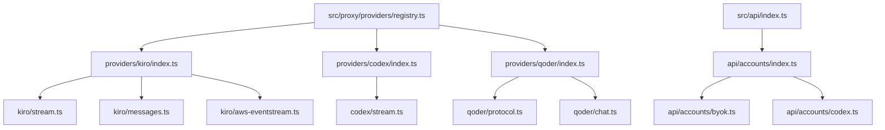
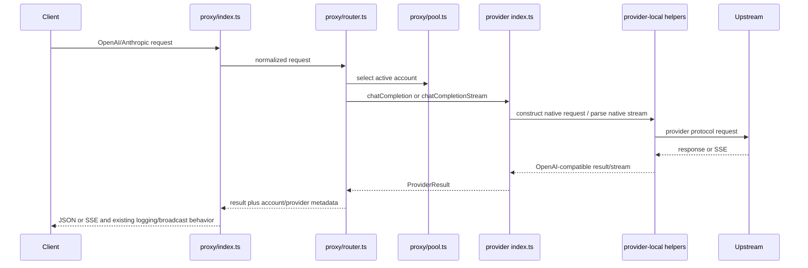

# Design Document

## Overview

The refactor is an import-preserving relocation. Existing runtime behavior remains in the same functions and methods; files move only along cohesive responsibility boundaries. Each provider keeps one adapter class as its public entry point, while complex protocol or streaming work is extracted into provider-local modules.

The migration is intentionally ordered from isolated adapters to shared route composition:

1. Kiro, Codex, and Qoder directory moves.
2. BYOK route de-duplication and account API split.
3. Optional later extractions from proxy request handling and account pooling.

No database migration, configuration migration, route rename, dashboard contract change, or upstream protocol change is part of this design.

## Current Findings

| Area | Current file | Lines | Primary responsibilities |
| --- | --- | ---: | --- |
| Kiro provider | `src/proxy/providers/kiro.ts` | 982 | model catalog, token refresh, quota parsing, AWS request build, response parsing, live SSE translation |
| Codex provider | `src/proxy/providers/codex.ts` | 816 | model catalog, Responses API payload build, non-stream/SSE parsing, OAuth refresh, quota health checks |
| Qoder provider | `src/proxy/providers/qoder.ts` | 1539 | COSY cryptography, bearer protocol, chat transform, SSE parsing, PAT activation, quota/activity health |
| BYOK provider | `src/proxy/providers/byok.ts` | 906 | cache/model ownership, OpenAI and Anthropic request paths |
| Proxy handler | `src/proxy/index.ts` | 766 | API handlers, logging, usage summaries, stream finalization |
| Account pool | `src/proxy/pool.ts` | 568 | active-account cache, load balancing, in-flight state, account mutations |
| Account API | `src/api/accounts.ts` | 1655 | generic CRUD, bulk operations, BYOK groups, Qoder PAT, Kiro/Codex onboarding |

`src/api/accounts.ts` currently defines `POST`, `GET`, `PATCH`, and `DELETE` BYOK routes twice. The first registrations at lines 160–664 are the currently effective Hono handlers; the later registrations at lines 1460–1655 are unreachable duplicates. The refactor retains the first implementation's grouped multi-key behavior and removes the later legacy implementation.

## Target Architecture



## Provider Module Layout

### Kiro

```text
src/proxy/providers/kiro/
├── index.ts
├── stream.ts
├── messages.ts
└── aws-eventstream.ts
```

- `index.ts` exports `KiroProvider` and `KiroVariant`. It owns model metadata, standard/pro variant selection, token access and refresh, quota/health operations, and Kiro request construction.
- `stream.ts` exports a provider-local function that converts AWS event-stream responses into OpenAI SSE. It receives explicit dependencies such as model metadata, ID generation, token estimation, and event helpers rather than importing the provider registry or pool.
- Existing `messages.ts` and `aws-eventstream.ts` are retained unchanged except for relative import adjustments. They are already cohesive low-level helpers and do not count as new split targets.

The unused legacy `createStreamResponse` method is not deleted in this migration. It remains colocated with its equivalent behavior or is covered by a direct test before any later removal decision.

### Codex

```text
src/proxy/providers/codex/
├── index.ts
└── stream.ts
```

- `index.ts` exports `CodexProvider`; it owns model metadata, token access, Responses API request normalization, request execution, OAuth token refresh, quota lookup, and health checks.
- `stream.ts` exports deterministic helpers for parsing a Codex Responses SSE sequence into either an OpenAI non-stream completion result or an OpenAI SSE stream. It receives an explicit context object for `generateId`, token estimation, and model ID.

Keeping stream state in `stream.ts` prevents the adapter class from simultaneously owning payload translation and hundreds of lines of SSE state-machine logic.

### Qoder

```text
src/proxy/providers/qoder/
├── index.ts
├── protocol.ts
└── chat.ts
```

- `protocol.ts` owns COSY constants, custom encoding, RSA/AES session construction, signature headers, bearer request construction, and PAT/job-token exchange. It exports the currently used helpers `openApiHeaders`, `encodeQoderPayload`, `signatureHeaders`, `bearerFetch`, and the narrow types they require.
- `chat.ts` owns model definitions, template loading, OpenAI/Anthropic content normalization, stable session ID derivation, native chat body construction, tool call normalization, and upstream SSE line parsing.
- `index.ts` exports `QoderProvider` and `activateQoderPat`. It owns account-token parsing, request/stream orchestration, token refresh, quota/activity calls, and health classification while delegating protocol and payload logic to the two local modules.

Three files are justified here because security-sensitive COSY code, request conversion, and provider lifecycle state are distinct concerns. They must not be merged merely to meet a line-count target.

### Import Compatibility

After each move, `registry.ts` imports an explicit provider entry path, for example `./kiro/index`, avoiding ambiguous resolution while an old file is being removed. All other internal imports are changed atomically in the same provider slice. Any Qoder helper used by `src/api/accounts.ts` remains exported by `qoder/index.ts` so its caller need not understand protocol internals.

## Account API Layout

```text
src/api/accounts/
├── index.ts
├── byok.ts
└── codex.ts
```

- `index.ts` constructs and exports `accountsRouter`, registers literal paths before `/:id`, and contains generic account CRUD, bulk create/delete, toggle actions, Qoder PAT account creation, and Kiro instant-login handling.
- `byok.ts` exports a registration function receiving the shared router. It contains BYOK types, key/group normalization, the effective create/list/reveal/update/delete/test routes, load-balancing setting helpers, cache invalidation, and broadcasts.
- `codex.ts` exports Codex token/account helpers currently consumed by login flows: JWT payload decoding, access-token import, authorization-code exchange, refresh-token bulk import, and the instant-login handler.

`src/api/index.ts` changes its import to `./accounts/index` and keeps mounting `accountsRouter` at `/accounts`. Route URLs do not change. The old `accounts.ts` file is removed only after all consumers have been updated.

## Data Flow Preservation



The call graph and all lifecycle ownership remain unchanged. Refactoring only relocates helper functions and imports.

## Error Handling

- Existing error messages, retry classifications, `quotaExhausted`, `rateLimited`, and expired-token markers remain unchanged.
- Extracted parsing helpers throw or return the same value as before; adapters retain the existing `try/catch` boundary that converts errors to `ProviderResult`.
- No new catch-all fallback is introduced around upstream calls.
- File movement must not log decrypted credentials, raw tokens, API keys, or full authorization headers.
- Route de-duplication uses the currently matched BYOK behavior as the source of truth. A test validates route precedence before deletion of legacy blocks.

## Testing Strategy

### Static checks

1. Run `bunx tsc --noEmit` for the backend after each migration slice.
2. Run `bun run build` to execute the dashboard's `tsc -b && vite build` after all backend import paths settle.

### Focused deterministic tests

- Kiro: request construction, non-stream event decoding, live SSE framing, tool-call chunks, usage/credit extraction, Kiro-Pro model resolution, and token refresh retry.
- Codex: request payload conversion, reasoning deltas, function-call accumulation, completion conversion, SSE terminal frames, OAuth refresh, and quota parsing.
- Qoder: custom payload encoding, signature/bearer header construction, session ID stability, request body conversion, upstream SSE parsing, PAT activation token shape, and activity quota mapping.
- Accounts: literal route precedence, each BYOK HTTP method, multi-key group update/delete behavior, key masking/reveal, cache refresh, and Codex helper exports.

### Integration checks

- Use mocked `fetch`/`ReadableStream` tests for deterministic protocol behavior.
- Keep existing credentialed network tests opt-in and isolated from default validation.
- Run a manual local smoke check only with an existing local `.env`; do not manufacture or print secrets.

## Rollout and Revert Strategy

Each provider is one independent commit-sized slice:

1. Add target modules and move implementation without changing logic.
2. Update imports and provider registry path.
3. Run focused tests and typecheck.
4. Inspect the diff to confirm no endpoint, configuration, schema, or string constant changed unintentionally.

If a slice fails verification, revert that slice alone. Do not mix provider relocation with account route consolidation or shared proxy refactors.

## Follow-up Design: Proxy Core

After the provider and account slices are stable:

- Split `src/proxy/index.ts` into a route module and a request telemetry/stream-finalization module while keeping `proxyRouter` and `recordRequest` exports stable.
- Split `src/proxy/pool.ts` only around stateful account selection versus persistence/statistics helpers; retain a single `AccountPool` owner for in-flight counts, cache invalidation, and load-balancing state.
- Split `src/proxy/providers/byok.ts` into an entry module plus explicit OpenAI and Anthropic transport modules. This is deferred because its routing/cache state is shared across both transports.
